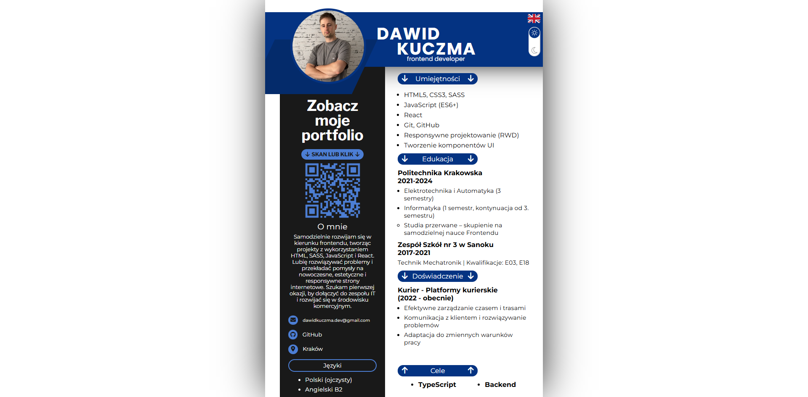
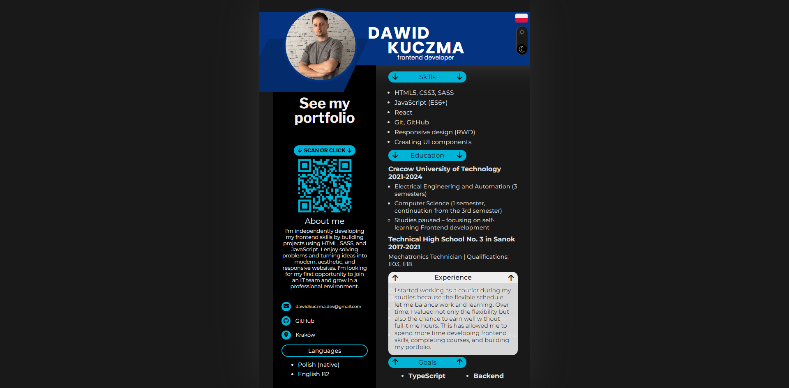

# 🪪 Interaktywne CV – Dawid Kuczma

Nowoczesne, interaktywne CV stworzone w HTML, SCSS i JavaScript, które prezentuje mnie jako frontend developera w dynamicznej formie. Projekt łączy w sobie funkcjonalność, styl i zaawansowane efekty interfejsu użytkownika.


## 🔗 Demo

👉 [Interaktywne CV – demo online](https://dawidkuczma-dev.github.io/cv-website/)

## 📸 Screenshots

<p align="center">
  
  
</p>


## ⚙️ Technologie

- HTML5
- SCSS (Sass)
- JavaScript (Vanilla)

## 📁 Struktura folderów

```bash
📁 CV-Website
├── 📁 assets
|   ├── 📁 images
│   |   ├── qrCode.png
│   |   ├── qrCodeHover.png
│   |   └── ...
│   └── 📁 lang
│       ├── en.json
│       └── pl.json
├── 📁 css
│   └── main.css
├── 📁 js
│   ├── i18n.js
│   ├── main.js
│   └── video.js
├── 📁 scss
│   ├── _base.scss
│   ├── _darkmode-toggle.scss
│   └── ...
├── index.html
└── README.md

📁 assets/images – zawiera zrzuty ekranu, qrCode'y, ikony i zdjecie oraz film profilowy  
📁 assets/lang – tłumaczenia en / pl 
📁 js – skrypty odpowiedzialne za tłumaczenie, rozwijane sekcje oraz video
📁 scss – pliki źródłowe stylów (moduły SCSS)  
📁 css – skompilowany plik stylów dla strony

```

## ✨ Funkcje

- 🌙 **Tryb ciemny i jasny** – płynne przełączanie stylów
- 🌐 **Zmiana języka** – Zarządzanie językiem bez frameworków (PL/EN)
- 🎥 **Dynamiczne zdjęcie-profilowe** – początkowo film, który zatrzymuje się jako zdjęcie
- 📱 **Kod QR** – prowadzący do portfolio, z efektem kolorowej animacji po najechaniu kursorem
- 📂 **Rozwijane sekcje** – szczegółowe informacje o doświadczeniu, umiejętnościach, edukacji i celach  dostępne po kliknięciu

## 🧠 Czego się nauczyłem

- Zarządzanie stanem języka i trybu ciemnego bez frameworków
- Obsługa wideo w HTML5 oraz jego konwersja do statycznego obrazu
- Animacje CSS na elementach interaktywnych
- Tworzenie modularnych sekcji i rozwijanych paneli
- Łączenie designu z funkcjonalnością w realnym projekcie rekrutacyjnym

## 🚀 Uruchomienie lokalne

1. Sklonuj repozytorium  
```bash
git clone https://github.com/DawidKuczma-dev/cv-website.git
```
2. Otwórz plik `index.html` w przeglądarce lub uruchom lokalny serwer (np. Live Server)

## 📇 Autor

Dawid Kuczma  
[LinkedIn](https://www.linkedin.com/in/dawid-kuczma-a60836369/) • [GitHub](https://github.com/DawidKuczma-dev)

## 📝 Licencja

Ten projekt jest dostępny na zasadach licencji MIT.


