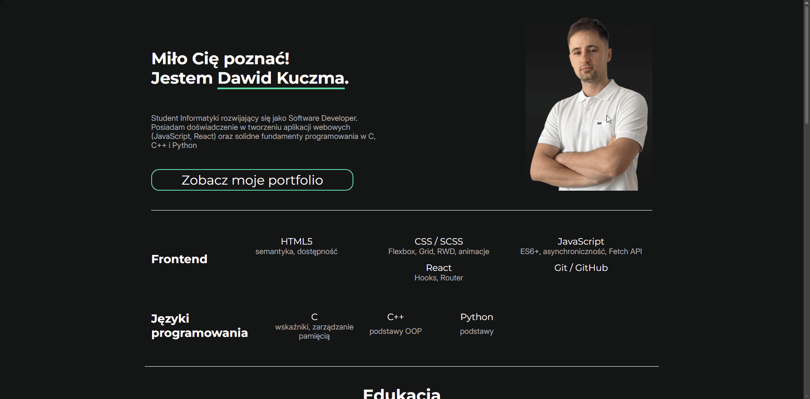
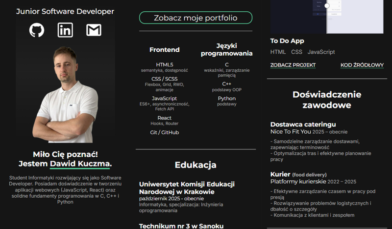

# 🪪 Interaktywne CV – Dawid Kuczma

Nowoczesne **interaktywne CV w formie strony internetowej**, stworzone przy użyciu **HTML, SCSS i JavaScript**.  
Projekt prezentuje moje umiejętności frontendowe, projekty oraz doświadczenie w dynamicznej i atrakcyjnej formie.

🌐 Strona została zaprojektowana jako alternatywa dla klasycznego CV.

## 🔗 Demo

<p align="center">
  <a href="https://dawidkuczma-dev.github.io/cv-website/">
    
  </a>
  <br>
  <b>🌐 Kliknij GIF aby zobaczyć stronę</b>
</p>

## ⚙️ Technologie


## 💡 Cel projektu

Celem projektu było stworzenie nowoczesnego, interaktywnego CV w formie strony internetowej, które pozwala w atrakcyjny sposób zaprezentować moje umiejętności, projekty oraz doświadczenie.

## ✨ Funkcje

- 📱 Responsywny layout (RWD) dostosowany do różnych rozdzielczości
- 🎬 Animacje pojawiających się sekcji podczas scrollowania
- 🖼️ Slider projektów z możliwością podglądu screenshotów
- 🔗 Linki do demo oraz kodu źródłowego projektów
- 🎨 Nowoczesny interfejs UI z wykorzystaniem SCSS
- 📬 Sekcja kontaktowa z szybkim dostępem do GitHub, LinkedIn i email

## 📸 Screenshots

### Mobile


## 📁 Struktura folderów

```bash
📁 cv-website
├── 📁 assets
|    └─ 📁 images
│       ├── CountryExplorer1.png
│       ├── CountryExplorer2.png
│       └── ...
├── 📁 css
│   └── main.css
├── 📁 js
│   ├── main.js
│   ├── scroll-animations.js
│   └── sliders.js
├── 📁 scss
│   ├── _base.scss
│   ├── _education.scss
│   └── ...
├── index.html
└── README.md

📁 assets/images – zawiera zrzuty ekranu projektów, ikony i zdjecie profilowe
📁 js – skrypty odpowiedzialne za animacje
📁 scss – pliki źródłowe stylów (moduły SCSS)  
📁 css – skompilowany plik stylów dla strony

```

## 🧠 Czego się nauczyłem

- projektowania struktury większej aplikacji frontendowej
- organizacji stylów przy użyciu modułowego SCSS
- implementacji animacji scrollowych w JavaScript
- optymalizacji struktury HTML pod kątem semantyki i dostępności
- zarządzania interakcjami użytkownika i dynamicznymi elementami UI

## 🚀 Uruchomienie lokalne

1. Sklonuj repozytorium  
```bash
git clone https://github.com/DawidKuczma-dev/cv-website.git
```
2. Otwórz plik `index.html` w przeglądarce lub uruchom lokalny serwer (np. Live Server)

## 🔮 Możliwe ulepszenia

- dodanie trybu **dark / light**
- dodanie języka angielskiego
- formularz kontaktowy

## 📇 Autor

Dawid Kuczma  
[LinkedIn](https://www.linkedin.com/in/dawid-kuczma-a60836369/) • [GitHub](https://github.com/DawidKuczma-dev)

## 📝 Licencja

Ten projekt jest dostępny na zasadach licencji MIT.
